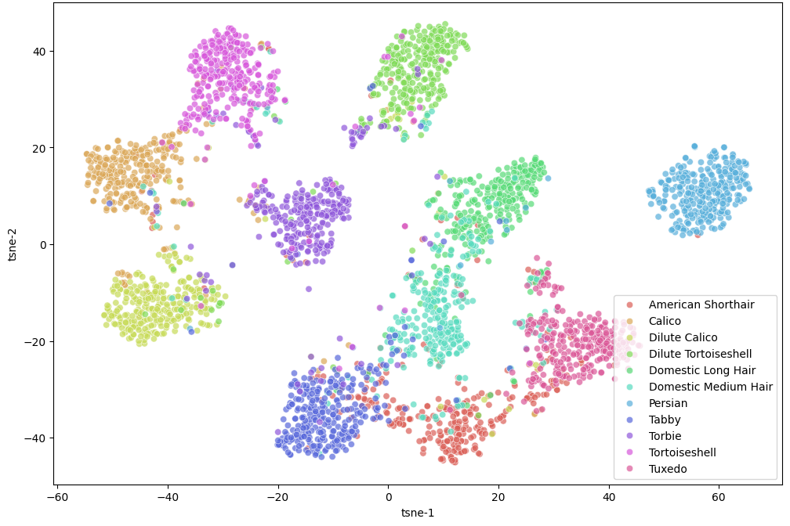
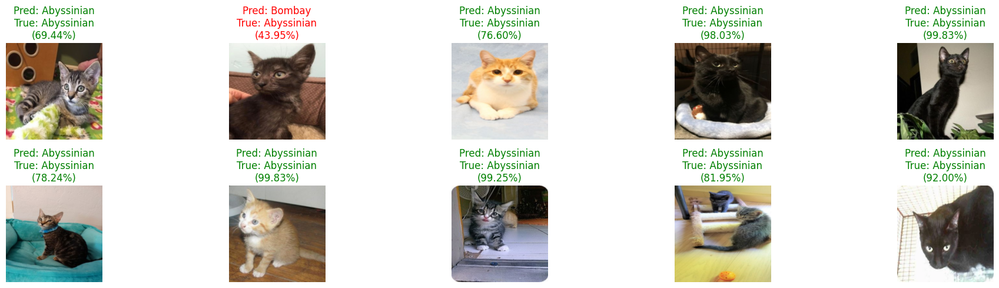

# Cat-Breed-Classifier

พัฒนาโมเดลจำแนกสายพันธุ์แมว 11 สายพันธุ์ โดยใช้เทคนิค Deep Metric Learning เพื่อเพิ่มประสิทธิภาพในการแยกแยะลักษณะที่คล้ายคลึงกัน

## 🛠️ Tech Stack & Methodology
- **Model:** EfficientNetV2-S (ImageNet-1K Pretrained)
- **Framework:** PyTorch
- **Techniques:**
  - **Metric Learning:** ใช้ Triplet Loss and Hard Negative Mining เพื่อเพิ่มระยะห่างใน embedding space ระหว่างแต่ละ class
  - **Visual Analytics:** วิเคราะห์ feature space ด้วย t-SNE และประเมินผลด้วย Confusion Matrix (Heatmap)

## 🔍 t-SNE Visualization

  

## 🔍 Inference

  

## 🚀 Quick Links
- **Code & Outputs** [Open in Google Colab With Outputs](https://drive.google.com/file/d/1nqIAChKjZCi7QEiTW6r31EXkDTftMWE9/view?usp=sharing)

